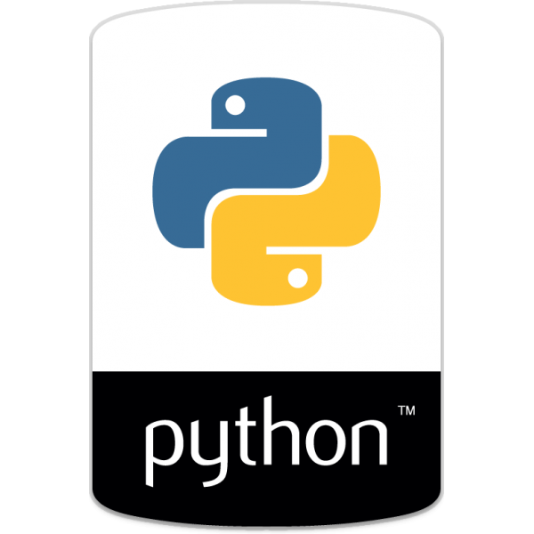
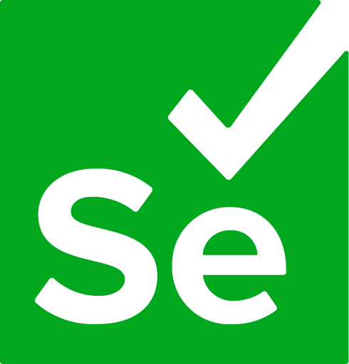
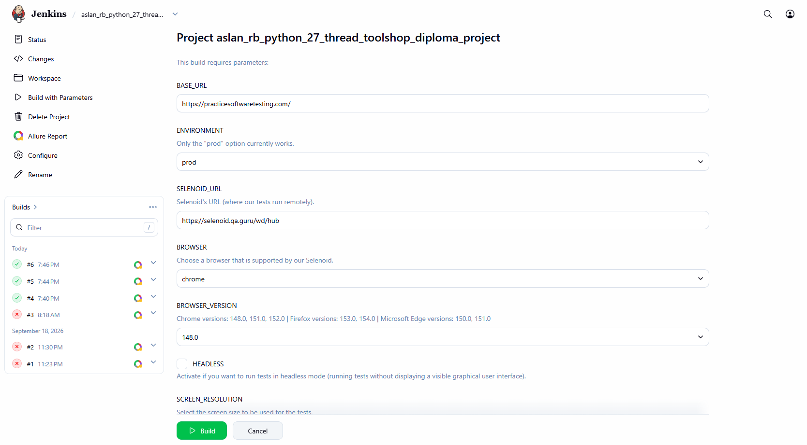
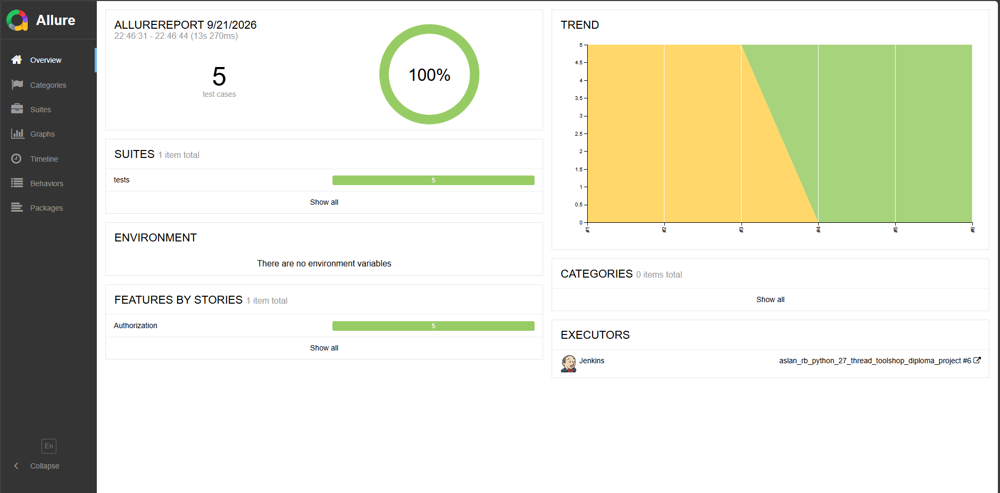
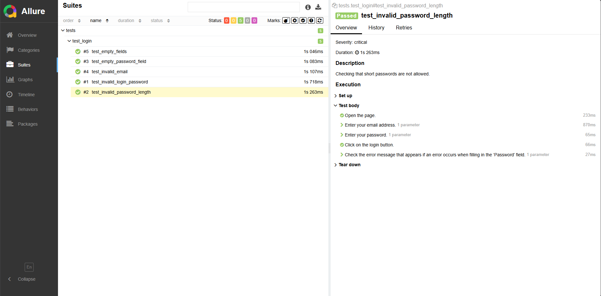
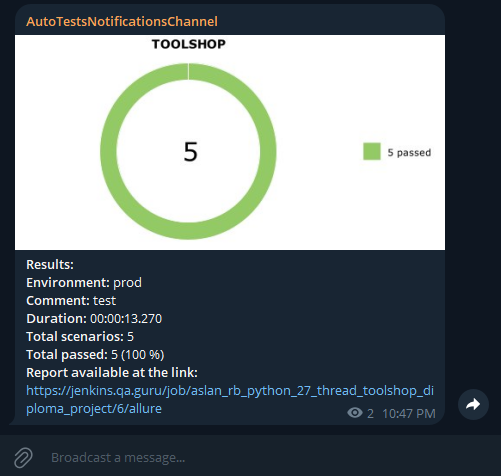

# Проект автоматизации тестирования [TOOLSHOP](https://practicesoftwaretesting.com/).

## Содержание:

- Технологии и инструменты используемые для тестирования данного проекта.
- Реализованные проверки:
    - Тесты пользовательского интерфейса (WEB).
- Способы запуска авто-тестов:
    - Локальный запуск;
    - Удаленный запуск;
    - Параметры для запуска тестов в Jenkins.
- Визуализация.

## Технологии и инструменты используемые для тестирования данного проекта.

<p style="text-align: left;">
<a href="https://www.python.org/"> </a>
<a href="https://docs.pytest.org/en/stable/"> </a>
<a href="https://www.jetbrains.com/pycharm/"> </a>
<a href="https://www.selenium.dev/"> </a>
<a href="https://www.jenkins.io/"> </a>
<a href="https://aerokube.com/selenoid/"> </a>
<a href="https://telegram.org/"> </a>
</p>

Для предоставления отчетности о выполнении тестов использован инструмент — `Allure-Report`.
Отчет состоит из следующих элементов:

- Шаги;
- Снимок экрана для последнего шага теста;
- Видео выполнения;
- Исходный код страницы;
- Логи консоли браузера.

Дополнительным инструментом уведомления о прохождении тестов выступает ```telegram bot``` отправляющий отчет в
специально созданный для этого канал.

Указанные выше инструменты позволяют не только предоставить отчетность менеджерам, но и в случае проблем быстрее
позволит
разобраться в причине падений тестов.

Удаленный запуск WEB тестов осуществляется с помощью `Selenoid`, который представляет собой ферму браузеров, а системой
CI/CD
выступает — `Jenkins`.

## Реализация тестов.

#### Тесты WEB:

Есть негативные тесты для аутентификации проверяющие различные случаи (неправильные почта/пароль, пустые поле и т. п.).

## Запуск авто-тестов.

<details>
<summary>Нажмите, чтобы раскрыть/скрыть.</summary>

Все команды необходимо выполнять в эмуляторе терминала (консоль).

#### Локальный запуск авто-тестов.

```bash
pytest -sv tests
```

#### Удаленный запуск авто-тестов.

```bash
pytest tests -s --base-url=$BASE_URL --selenoid-url=$SELENOID_URL --environment=$ENVIRONMENT --browser=$BROWSER --browser-version=$BROWSER_VERSION --headless=$HEADLESS --screen-resolution=$SCREEN_RESOLUTION
```

> `--base-url` — Адрес стенда для UI тестов.
>
> `--selenoid-url` — Адрес на котором развернут Selenoid (для удаленного выполнения UI тестов).
>
> `--browser` — Браузер в котором будут выполняться тесты.
>
> `--browser-version` — Версия браузера.
>
> `--screen-resolution` — Размер окна браузера.
>
> `--headless` — Параметр отвечающий за запуск тестов без отображения графического интерфейса.
>
> `--environment` — Конфиг для какого окружения должен использоваться для запуска тестов.

#### Запуск тестов из Jenkins:

```bash
python -m venv .venv
source .venv/bin/activate
pip install -r requirements.txt
pytest tests -s --base-url=$BASE_URL --selenoid-url=$SELENOID_URL --environment=$ENVIRONMENT --browser=$BROWSER --browser-version=$BROWSER_VERSION --headless=$HEADLESS --screen-resolution=$SCREEN_RESOLUTION
```

</details>

## Визуализация.

### Запуск тестов в <a href="https://jenkins.qa.guru/job/aslan_rb_python_27_thread_toolshop_diploma_project/"> Jenkins: </a>

<div style="text-align: left;">
    
</div>

### Отчеты в <a href="https://jenkins.qa.guru/job/aslan_rb_python_27_thread_toolshop_diploma_project/6/allure/"> Allure Report: </a>

#### Главная страница отчета:

<div style="text-align: left;">
    
</div>

#### Страница набора тестов.

<div style="text-align: left;">
    
</div>

#### Пример отправляемого отчета в telegram:

<div style="text-align: left;">
    
</div>

#### Видео выполнения теста в Selenoid (Для наглядности был добавлен sleep):

<div style="text-align: left;">
    
</div>